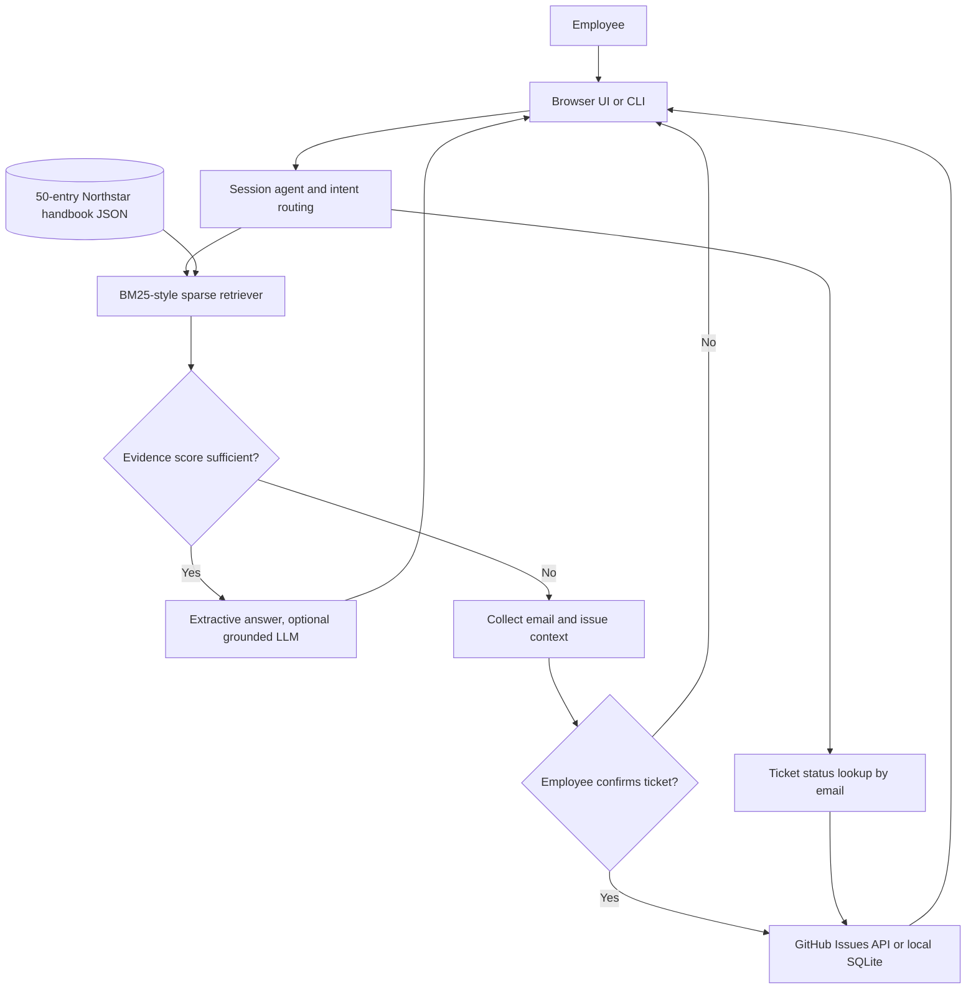

# SmartDesk Assistant

SmartDesk is a first-line IT and People Operations assistant for the fictional Northstar Systems. It answers only from a curated employee handbook, escalates unsupported questions with explicit employee confirmation, and retrieves tickets by email. The bundled app runs without an LLM key or external service; configure GitHub Issues to use a live ticket queue.

## Run locally

Requires Python 3.10 or newer; no third-party packages are needed.

```powershell
cd SmartDesk_Assistant
Copy-Item .env.example .env
# Optional: edit .env to configure LLM and GitHub Issues credentials.
python app.py
```

Open http://127.0.0.1:7860. For a terminal interface, run `python cli.py`. The deterministic BM25-style sparse retriever, extractive answers, session state, and local SQLite tickets work without credentials. Do not expose the development server to the public internet.

## Configuration

| Variable | Required | Purpose |
|---|---|---|
| `OPENAI_API_KEY` | No | Enables optional OpenAI-compatible grounded answer phrasing; handbook excerpts are the only context sent. |
| `OPENAI_BASE_URL` | No | API root; defaults to OpenAI. |
| `OPENAI_MODEL` | No | Chat model; defaults to `gpt-4o-mini`. |
| `GITHUB_TICKETS_REPO` | For live tickets | GitHub repository in `owner/name` form. |
| `GITHUB_TOKEN` | For live tickets | Fine-grained token with Issues read/write permission for that repository. Keep it in the environment; never commit it. |
| `SMARTDESK_DB` | No | SQLite file path for local/demo tickets. |
| `HOST`, `PORT` | No | Web server bind address and port; defaults to `127.0.0.1:7860`. |

When both GitHub settings are present, ticket writes and status reads use the GitHub Issues API. Without them, tickets persist in SQLite. The local adapter is for demos and automated verification, not shared production use. API failures return a polite retry message. The optional language model retries once and falls back to the exact retrieved handbook answer.

## Knowledge base and retrieval

`data/knowledge_base.json` contains 50 synthetic, Northstar-specific entries across IT, HR, onboarding, and payroll. It intentionally omits topics such as monitor hardware troubleshooting. Each entry has a stable ID, category, question, and answer. `KnowledgeBase` ingests this JSON at startup and uses BM25-style sparse ranking with question-field coverage and phrase reranking. The score threshold rejects weak matches. Answers are extractive by default and include source IDs; when configured, the optional LLM sees only retrieved entries and must decline unsupported claims. Update the JSON using the same four-field structure; tests check representative coverage and the intended unsupported path.

## Ticket conversation

For an unsupported question, SmartDesk tells the employee it lacks sufficient handbook evidence, collects their work email, summarizes the issue and infers IT/HR category, then displays the full ticket fields and asks for a yes/no confirmation. No write occurs before a yes. A successful creation returns the ticket ID and URL. Ticket status lookup asks for email if needed, lists multiple matches for selection, reports the latest GitHub comment, and clearly handles no results. Session state preserves email and pending actions per browser session.

## Architecture



## Verify

Install the optional test dependency with `python -m pip install -r requirements-dev.txt`, then run `python -m pytest -q` from this folder. The tests cover KB breadth and retrieval, deliberate gaps, confirmation and cancellation, ticket creation, status with multiple tickets and no results, API outage responses, LLM fallback, greetings, and per-session context. Tests use a temporary SQLite database and do not call external APIs.

## Example flows

- **Grounded answer:** “How do I reset my password?” returns the password portal process with source `it-01`.
- **Escalation:** “My monitor flickers” collects email, previews a ticket, waits for yes, then returns a local `SD-...` ID or GitHub issue link.
- **Status:** “Check my ticket status” asks for email, lists matching issues if there are multiple, and returns status plus latest update.

## Security and limitations

The sample organization, policies, contacts, links, and ticket data are synthetic. Replace and review them before organizational use. Email is stored with ticket data. GitHub search uses the configured issue repository. The local mode has no authentication; use it only for a local demo. The web server is a minimal development interface, not a hardened production deployment.

